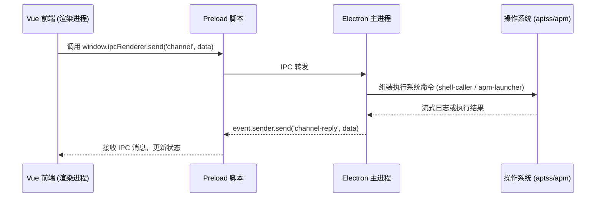

# 系统架构与执行流程

本文档旨在为开发者提供星火应用商店（APM App Store）底层的代码执行流程与接口调用的详细说明。
主要涵盖了从前端界面的分类列表展示、应用查找，再到后端执行下载、安装、更新和卸载的完整生命周期。

## 目录
- [整体架构概述](#整体架构概述)
- [分类与找包流程](#分类与找包流程)
- [下载与状态流转](#下载与状态流转)
- [安装/更新/卸载与后端命令执行](#安装更新卸载与后端命令执行)
- [权限提升与特殊机制](#权限提升与特殊机制)

## 整体架构概述

星火应用商店采用 **Electron + Vue 3** 架构。
- **渲染进程 (Vue 3前端)**：负责页面展示（如分类浏览、应用列表、搜索、详情），维护下载队列状态（`downloads`），并监听用户交互。
- **主进程 (Electron Node.js)**：负责底层的系统调用和资源管理。前端通过 IPC (`ipcRenderer` / `ipcMain`) 向主进程发送指令，主进程在 `install-manager.ts` 等模块中解析指令，区分 `spark` 软件和 `apm` 软件，并调用系统底层的包管理器命令（如 `aptss` 或 `apm`）。

### 核心 IPC 通信模型



## 分类与找包流程

用户在界面上浏览应用、根据分类找包的流程完全在前端完成。

1. **获取应用列表**：应用启动时，`App.vue` 会根据系统架构和来源配置（`apm` 或 `spark`），并发调用 `fetchWithRetry` 去获取远端的 `applist.json` 等文件。
2. **构建分类字典**：解析后的数据会合并到 `categories` 中，包含了每个分类的名称（如 "development"）及其对应的中文名和应用来源。
3. **前端渲染与过滤**：
   - 侧边栏 `AppSidebar.vue` 显示各个分类和应用数量。
   - 当用户点击某个分类时，触发 `select-category` 事件，更新 `App.vue` 中的 `activeCategory` 状态。
   - 主列表视图根据当前的 `activeCategory` 从合并后的应用数组中过滤（`app.category === activeCategory.value`），并将结果传递给 `AppGrid.vue` 渲染出 `AppCard.vue` 列表。

## 下载与状态流转

当用户在 `AppDetailModal.vue` 或 `AppCard.vue` 点击下载/安装后，前端和后端的流转过程如下：

1. **加入下载队列**：`src/modules/processInstall.ts` 中的 `processDownload` 方法会被调用。该方法会创建一个 `DownloadItem` 对象推入全局的 `downloads`（由 `src/global/downloadStatus.ts` 管理）。
2. **发送安装指令**：前端向主进程发送 `queue-install` IPC 消息，并携带该 `DownloadItem`（JSON 字符串）。
3. **后端处理下载**：`install-manager.ts` 接收到 `queue-install`，根据应用来源和架构，通过 HTTP 请求去获取应用的 Metalink 或 DEB 文件，并实时将 `install-log` (日志) 和 `download-progress` (进度) 推送回前端。
4. **前端状态更新**：`App.vue` 监听这些 IPC 事件，根据返回的 `id` 查找并更新对应的 `DownloadItem` 的状态（如 `downloading`, `installing`, `completed`, `failed`）。

### 特殊机制：取消下载

用户可以在 `DownloadDetail.vue` 或 `DownloadQueue.vue` 中点击取消下载按钮：
1. 触发 `cancelDownload` 方法。
2. 前端向主进程发送 `cancel-install` IPC 消息，主进程中对应的下载流或进程会被主动终止。
3. **特殊状态处理**：区别于直接从队列中删除（这会让用户感到困惑），前端会将该下载任务的状态显式标记为 `failed`（在部分逻辑和 UI 设计中可能映射为 `cancelled` 或保留 `failed` 状态供用户参考）。应用仍然保留在下载队列中，用户可以点击重试 (`handleRetry`)。

## 安装/更新/卸载与后端命令执行

应用下载完成后（或者用户发起更新、卸载时），主进程负责执行系统的包管理命令。主进程的核心处理器是 `electron/main/backend/install-manager.ts`。

在组装命令时，主进程会严格区分应用的来源属性：**`origin: "spark" | "apm"`**。

- **对于 Spark 软件 (`origin: "spark"`)**：
  - 下载的通常是标准的 DEB 包。
  - 主进程会调用系统的 `aptss` 或 `ssinstall` 进行处理。
  - 例如卸载时执行：`aptss remove <pkgname>`。

- **对于 APM 软件 (`origin: "apm"`)**：
  - 主进程会判断系统中是否存在 `apm` 命令。如果不存在，则可能引导用户提权安装 APM 容器环境。
  - 卸载或更新时，会明确调用 `apm` 命令，如 `apm remove <pkgname>` 或 `apm upgrade <pkgname>`。
  - 针对跨架构/容器的更新（Cross-upgrade），还会执行更复杂的逻辑比对版本（通过 `dpkg --compare-versions`）。

```mermaid
flowchart TD
    A[接收安装/卸载指令] --> B{判断 origin 属性}
    B -- origin: "spark" --> C[组装 aptss / ssinstall 命令]
    B -- origin: "apm" --> D{检查是否安装 apm 命令}
    D -- 未安装 --> E[提权安装 apm 环境]
    D -- 已安装 --> F[组装 apm 命令]
    C --> G[通过 shell-caller 提权执行]
    E --> G
    F --> G
    G --> H[流式读取 stdout/stderr]
    H --> I[通过 IPC 返回日志与结果给前端]
```

## 权限提升与特殊机制

在 Linux 下，安装、卸载和更新软件包通常需要 Root 权限。为了在图形界面下安全地执行这些操作而无需用户在终端中输入密码，星火应用商店采用了特定的包装脚本。

### shell-caller.sh

大部分涉及系统级的命令（如 `aptss install`, `aptss remove` 等）不直接使用 `child_process.spawn("aptss", ...)`，而是通过包装脚本 `/opt/spark-store/extras/shell-caller.sh` 来执行。

- **功能**：该脚本内部封装了 `pkexec` 等提权逻辑。当调用 `shell-caller.sh aptss install ...` 时，如果系统需要提权，会自动弹出图形化的 Polkit 密码输入框。
- **安全性**：主进程避免使用 `shell: true`，而是将参数作为数组传递给 `shell-caller.sh`，防止命令注入漏洞。

### apm-launcher

当涉及到 APM 容器应用的一些特定操作（如在用户的隔离环境中运行或卸载应用）时，主进程可能会调用 `/opt/spark-store/extras/apm-launcher`。

- **场景**：例如卸载一个 APM 软件时，命令路径会被设定为 `apm-launcher`，从而确保 `apm` 命令以正确的上下文和权限运行。
- **日志捕获**：所有通过这些包装脚本执行的命令，主进程都会通过 `spawn` 的 `stdout` 和 `stderr` 监听其输出，并将这些日志逐行封装进 `install-log` IPC 消息中反馈给前端的 `DownloadDetail.vue` 进行展示。

---
